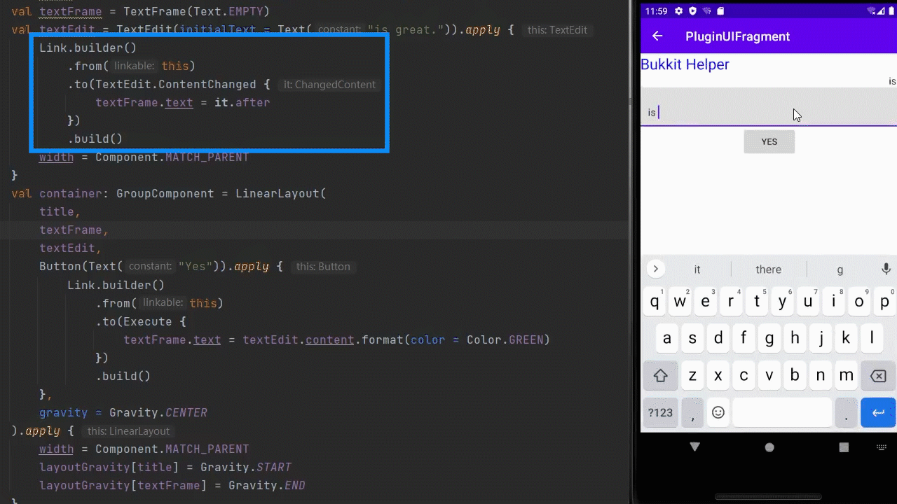
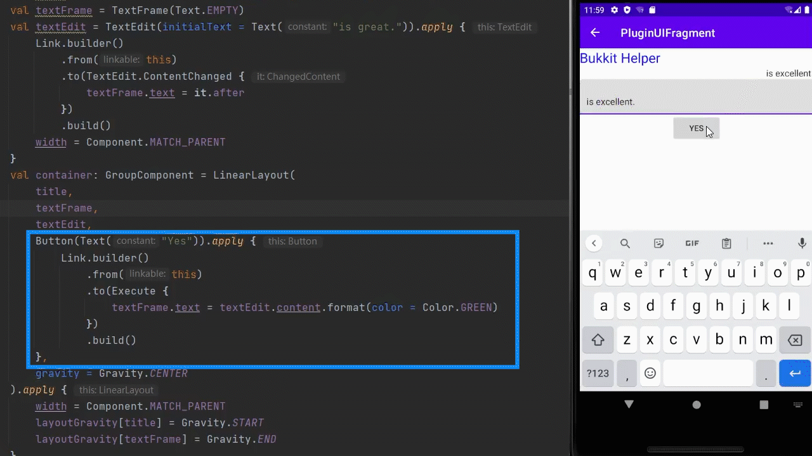

# Bukkit Helper
A bridge between bukkit sever and Android devices.
## Plans
Instead of the classic all-in-one style app,
aside from some built-in tools,
I would rather build a platform for other developers
to design functions they wish, and provide
advanced ways to implementation.

What I need to code:
* Installable Jar & APK plugins
* User-friendly plugin manager
* Flexible charts
* Reliable, efficient and extendable C/S bridge
* Modern UI constructor
## Features (implemented)

### Redesigned User Interface API
Traditional XML-based way to create UI is replaced with
the modern Kotlin-based form.
```kotlin
val container: GroupComponent = LinearLayout(
    TextFrame(
        Text(
            constant = "Bukkit Helper",
            size = 24,
            color = Color.BLUE
        )
    ),
    TextFrame(Text("is great.")),
    gravity = Gravity.CENTER
)
```
instead of
```xml
<?xml version="1.0" encoding="utf-8"?>
<LinearLayout
        xmlns:android="http://schemas.android.com/apk/res/android"
        android:layout_width="match_parent"
        android:layout_height="match_parent"
        android:orientation="vertical"
        android:gravity="center">
    <TextView
        android:layout_width="wrap_content"
        android:layout_height="wrap_content"
        android:text="Bukkit Helper"
        android:textColor="@android:color/blue"
        android:textSize="24sp"/>
    <TextView
        android:layout_width="wrap_content"
        android:layout_height="wrap_content"
        android:text="is great."/>
</LinearLayout>
```
To make the components function, _Link_ is created, replacing
listeners.


### Dynamic Chart API
An example to fetch TPS(a measurement of server's smoothness) constantly.
```kotlin
val format
get() = object : ValueFormat() {
    val sdf = SimpleDateFormat("kk:mm:ss", Context.locale)
    override fun axis(value: Float): String {
        val receiveTime = (value * 1000.0).toInt() + timeStart
        return sdf.format(Date(receiveTime))
    }
}
var timeStart = System.currentTimeMillis()

val main: Series = Series(DynamicList(), Text(R.string.title_tps))
val chart: Chart = Chart(
    series = main,
    label = Text(R.string.title_tps),
    LineChartConfiguration(xFormat = format)
)

fun timeElapsed(): Long = System.currentTimeMillis() - timeStart

fixedRateTimer(
            name = "TPS-Task",
            period = Context.dynamicRefreshInterval[DynamicRefreshInterval.KnownName.TPS].toLong()
) {
    val command = TPSFetchCommand()
    command.addCompleteListener {
        if (it == null) return@addCompleteListener
        main.data.add(ChartElement(timeElapsed() / 1000F, it.toFloat()))
        if (main.data.size > 1000) {
            // Boundary is 1000
            main.data.removeAt(0)
        }
    }
    Server.sendCommand(command)
}
```

